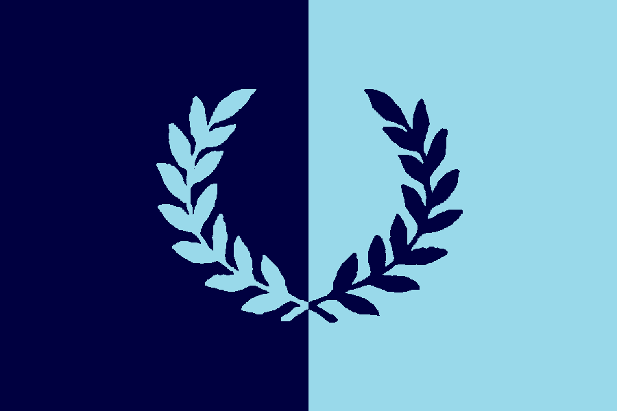

# Welcome to the 2017 Varsity Cross Country Match

From Thames Hare and Hounds’ Headquarters,
Memorial Playing Fields, Roehampton Vale
on Saturday, 2nd December

ORDER OF EVENTS

1:00 p.m. 26th Old Blues’ Race 4 miles
(Mob Match – all alumni welcome)

2:00 p.m. 42nd Ladies’ Race 4 miles
(Seven-a-side, five-to-score)

2:45 p.m. 127th Gentlemen’s Race 7½ miles
(Eight-a-side, six-to-score)

## Live Results [here](https://dev-data.opentrack.run/x/2017/GBR/varsityxc/event/)

## Historic results [here](/xcvm_results.json)

## Programme [here](/2017-VMProgramme-02Dec17.pdf)

